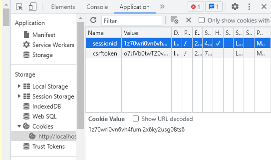

# Ensolvers to-do list project by Carolina Lopez

## Info:
For this particular project i used Django 3.2.9 as my framework, also working with Python 3.10.0, HTML and CSS for the customization of the page.

# How to run the app
1. Have Python, pip and django on your system
2. Git clone the repo
3. Execute "deploy.sh" script
> This script should open your default browser, and then start the server on localhost:8000 so you can try the app.

There's a bug that i couldn't fix on time. Sometimes when a registered user types incorrectly their password, it could lead to a TypeError. To fix this just follow the next steps:

1. Right click on the page and inspect to open console.
2. Navigate through the arrows to the "Application" option.
3. Delete the "sessionid" row  
